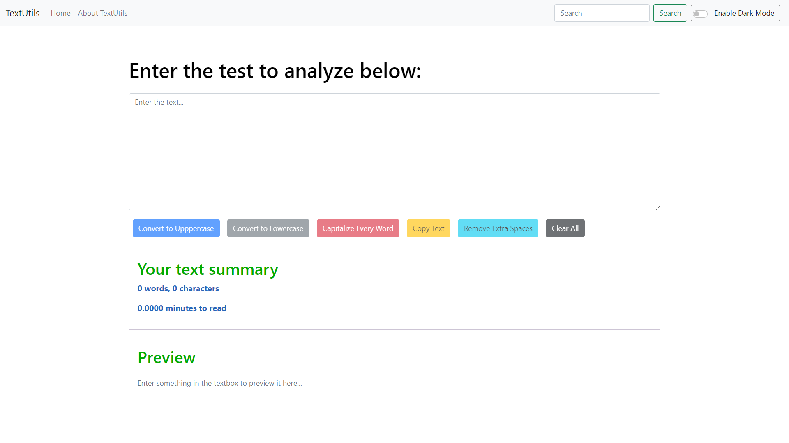
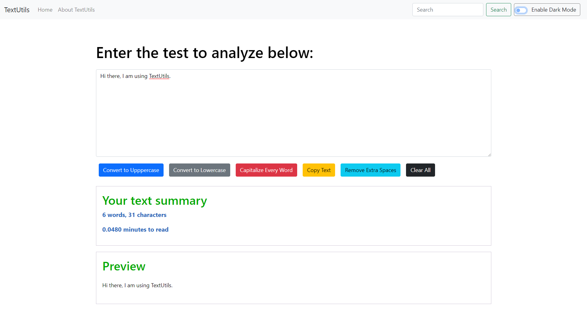
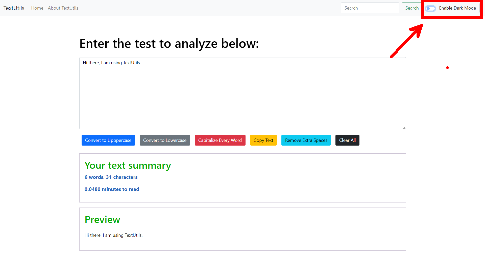
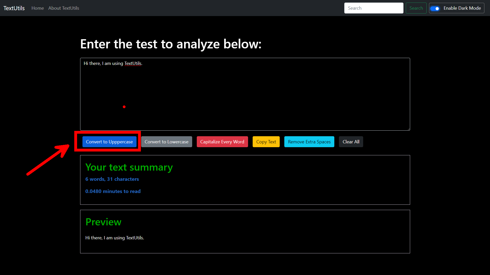
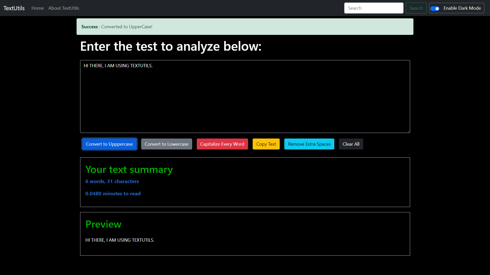
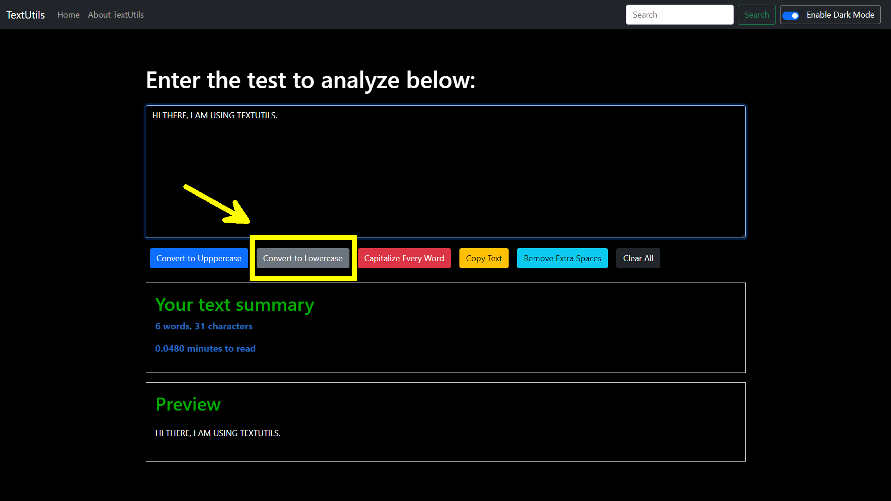
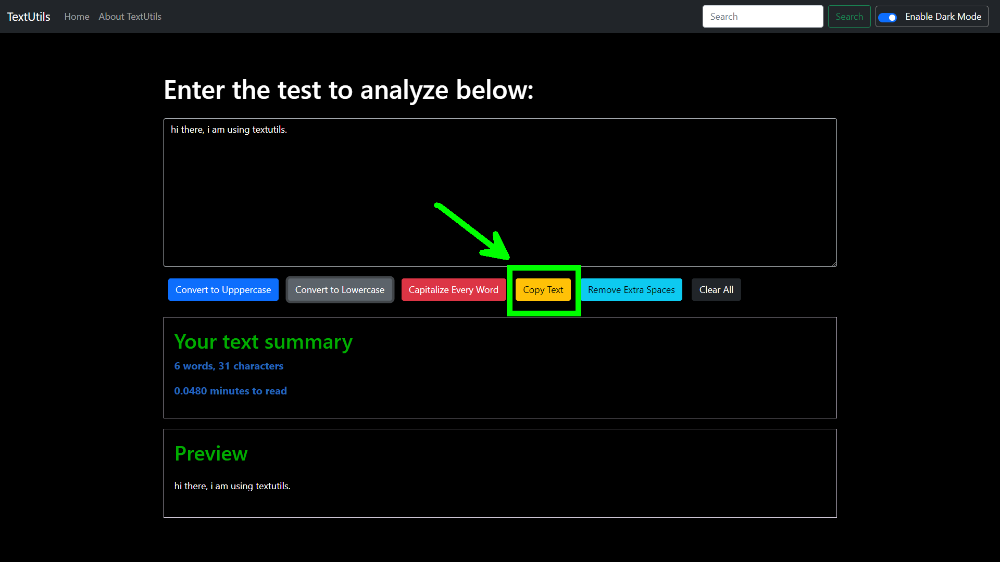
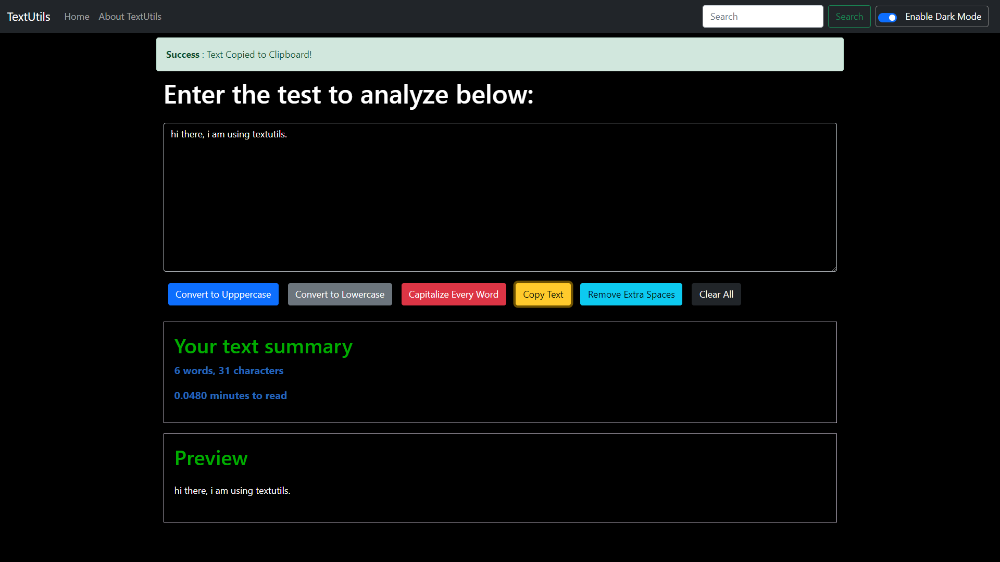
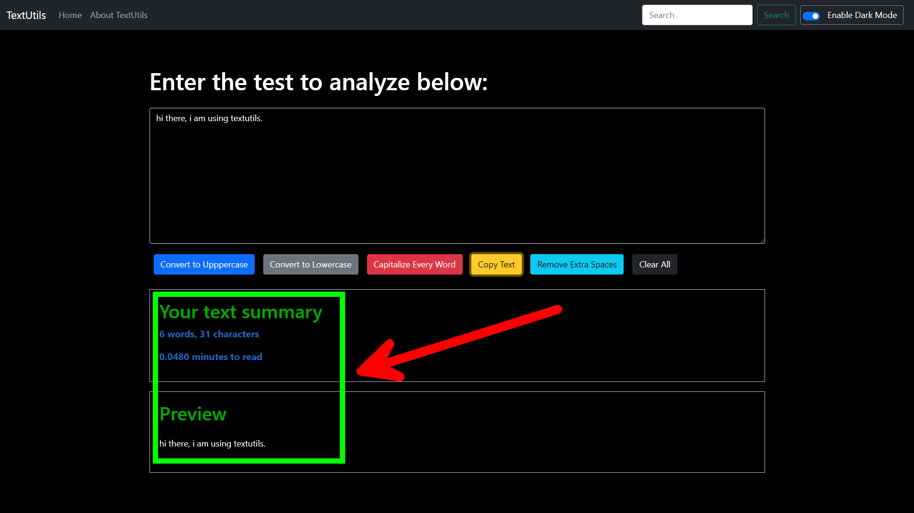

# TextUtils - Edit text online.
## **Tech Stack** : 
* HTML
* CSS
* JavaScript
* React Js
* Bootstrap
* Git / GitHub
___
## **Description** : 
* Easy to Use
* Offers various features
* Fast and Error free editing
* Preview Text file
* Shows charcter and Word count
* Dark mode available
* Completely free
___
## **Previews** : 
### Home Page (Light Mode)

### Entering Text

### Switching to Dark Mode


### Converting to UpperCase


### Converting to LowerCase


### Copying text to Clipboard


### Viewing Charater and Word Count



___
## **Download Links** : 
You can access my project from your local machine !
>https : https://github.com/anurag203/TextUtils-React

```bash
    git clone https://github.com/anurag203/TextUtils-React.git
```
___